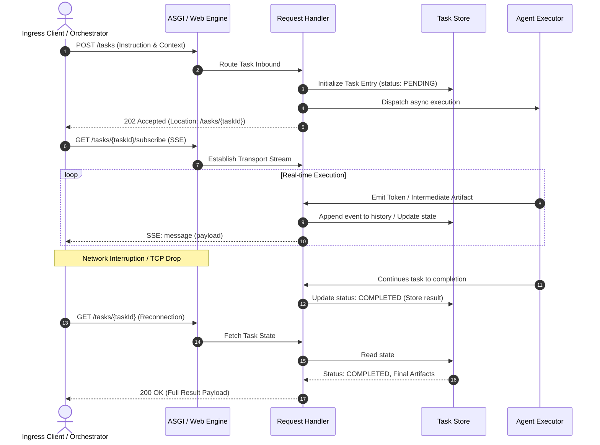

## Architectural Context: The A2A Server Boundary

The **A2A Server** acts as the control plane edge and ingress boundary for an autonomous agent. From a systems architecture perspective, it wraps the agent's internal orchestration logic within an HTTP/REST and streaming interface, enforcing protocol contracts, authentication boundaries, and state consistency.

Hosting transforms an isolated execution graph into a composable, network-addressable microservice capable of:
- **Autonomous Discovery:** Exposing self-describing manifests via standard endpoints.
- **Protocol Ingress & Demultiplexing:** Routing external task requests into the execution runtime.
- **State & Stream Management:** Mediating transient streaming connections (SSE) while persisting execution state across distributed failure domains.

---

## Component Topology & Responsibilities

The hosting runtime is partitioned into three decoupled architectural tiers:

```mermaid
graph TD
    Client[External Client / Routing Agent] -->|GET /.well-known/agent-card.json| Discovery[Discovery Tier: Agent Card Provider]
    Client -->|POST /tasks or GET /tasks/{id}/subscribe| Ingress[Ingress Tier: ASGI Engine / Starlette Router]
    
    subgraph A2A Host Service Boundary
        Ingress --> Handler[Application Tier: Request Handler]
        Discovery -.->|Exposes Capabilities| Ingress
        
        Handler -->|Lifecycle & Tracking| Store[(Persistence Tier: Task Store)]
        Handler -->|Invokes Operation| Exec[Execution Tier: Agent Executor]
        Exec --> Core[Domain Engine / LLM Logic]
        Exec -.->|Yields Events| Handler
    end

    Handler -->|Chunked SSE Stream| Client
```

| Component | Layer | Structural & Operational Responsibilities |
| :--- | :--- | :--- |
| **Agent Card Provider** | Service Discovery | Serves RFC-style metadata (`/.well-known/agent-card.json`). Supports dynamic capability pruning (e.g., exposing public subsets versus extended cards behind bearer tokens). |
| **ASGI Server & Engine** | Ingress / Transport | High-throughput async runtime (Starlette + Uvicorn) managing TCP connections, HTTP lifecycle, and open SSE streams without blocking thread pools. |
| **Request Handler** | Control Plane / Mediator | Implements protocol-level validation, delegates to the `AgentExecutor`, and manages the decoupling of execution and client delivery. |
| **Task Store** | Durability & Resilience | Persistent or distributed in-memory state repository (Redis, Postgres, DynamoDB). Tracks execution statuses, stores artifact pointers, and enables stream resubscription upon connection loss. |

---

## Ingress Lifecycle & Resubscription Mechanics

Enterprise A2A hosts must decouple execution lifecycles from network connection lifecycles. A persistent `Task Store` prevents orphaned processing and allows callers to recover interrupted streams.



---

## Architectural Considerations for Production Readiness

When designing and deploying A2A host nodes in distributed topologies, several architectural patterns apply:

### 1. Extended Metadata & Multi-Tenant Authorization
- **Standard Discovery:** Public instances serve a minimal Agent Card containing public endpoints and non-sensitive skill definitions.
- **Extended Discovery:** Upon mutual TLS (mTLS) or OAuth2/OIDC token validation, the host can dynamically serve an *Extended Agent Card* exposing privileged internal skills, elevated throughput quotas, or specialized model backends.

### 2. Transport Stream Decoupling
- Real-time client delivery relies on Server-Sent Events (SSE). 
- Because SSE connections are bound to specific host instances, distributed scaling requires either **sticky sessions** or a **centralized Pub/Sub backend** (e.g., Redis Pub/Sub, Azure Web PubSub) to allow clients to reconnect to any instance in the cluster and resume streaming via `Last-Event-ID`.

### 3. Graceful Task Cancellation
- Network termination (client dropping the connection) must not inherently trigger abrupt LLM interruption unless explicitly configured.
- The `Cancel` contract on the executor should be bound to explicit cancellation calls (`POST /tasks/{id}/cancel`), preventing wasted compute on stale connections while avoiding data corruption in long-running transactions.