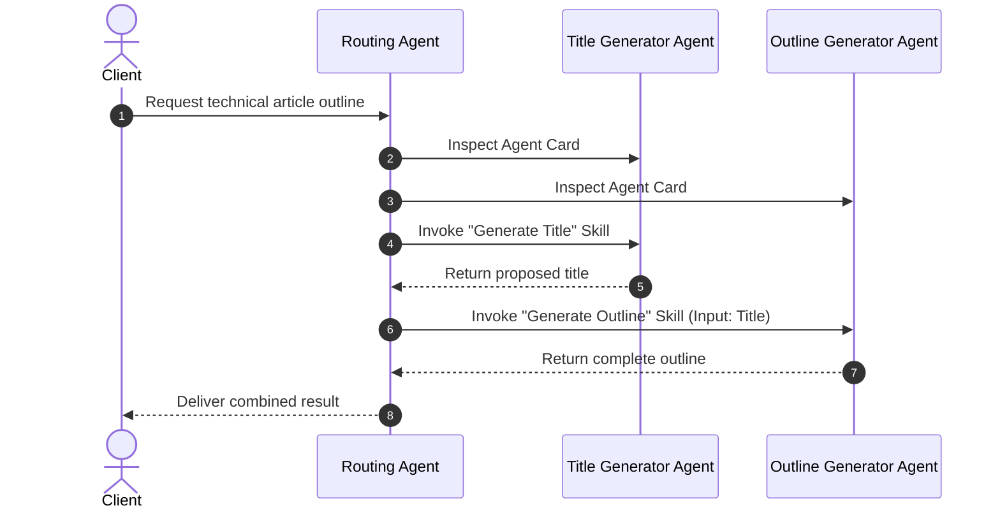

Here is a structured, professional overview of the reading material, organized for clarity and technical readability.

---

## Overview: The Agent-to-Agent (A2A) Protocol

The **Agent-to-Agent (A2A)** protocol establishes a standardized communication layer for artificial intelligence agents. It governs how independent agents exchange context, execute shared tasks, and transfer data securely. By adopting the A2A standard, agents built on different platforms or by different vendors can interoperate within unified multi-agent systems.

To participate in an orchestration workflow, an agent must advertise its capabilities. This self-description relies on two fundamental concepts: **Agent Skills** and the **Agent Card**.

---

## Core Advantages of A2A

The A2A protocol solves key integration challenges across multi-agent architectures:

- **Cross-Platform Collaboration:** Enables interoperability across disparate platforms and vendors, allowing decoupled services to collaborate without proprietary bridges.
- **Independent Model Selection:** Each agent operates autonomously regarding model selection, using the specific LLM or fine-tuned checkpoint best suited for its domain rather than sharing a single global model.
- **Native Authentication:** Security and identity verification are embedded directly within the protocol, standardizing access control across agent boundaries.

---

## Defining Capabilities: Agent Skills

An **Agent Skill** represents a discrete functional capability that an agent can execute. It defines the contract between the caller and the task implementation.

| Attribute | Description |
| :--- | :--- |
| **ID** | Unique machine-readable identifier for the skill |
| **Name** | Human-readable label describing the action |
| **Description** | Detailed explanation of what the skill performs |
| **Tags** | Categorization keywords used for indexing and discovery |
| **Examples** | Sample prompts or typical use cases illustrating input expectations |
| **Input/Output Modes** | Supported MIME types or data formats (e.g., `text/plain`, `application/json`) |

---

## Publishing Metadata: The Agent Card

The **Agent Card** serves as a machine-readable manifest (a digital business card) that clients or orchestrators inspect to discover endpoints and supported capabilities.

### Key Manifest Components

- **Identity Information:** Core metadata including the agent's name, version, and general scope.
- **Endpoint URL:** The network address hosting the A2A service.
- **Supported Capabilities:** Operational features supported by the runtime, such as response streaming or push notifications.
- **Default Input/Output Modes:** Baseline media types accepted and emitted by the agent.
- **Skills Catalog:** The complete array of exposed Agent Skills available for invocation.
- **Authentication Schema:** Security requirements and supported credential types.

---

## End-to-End Orchestration Flow

Once an agent publishes its Agent Card, orchestrators can resolve dependencies dynamically and chain tasks across specialized agents.

In practice, this architecture ensures that task execution remains modular: agents focus purely on their specialized domain, while routing agents handle composition using standardized protocol semantics.