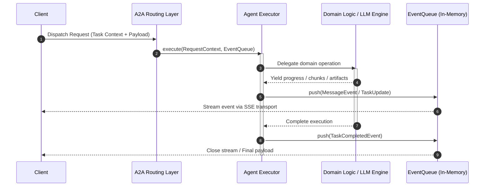

Here is a structured overview of the reading material, updated with technical precision and standardized formatting.

---

## Overview: The Agent Executor

The **Agent Executor** functions as the execution core within an Agent-to-Agent (A2A) implementation. It serves as the programmatic bridge decoupling the standardized A2A protocol layer from an agent’s internal business logic and model pipelines. 

While the Agent Card exposes *what* an agent can do, the Agent Executor governs *how* incoming tasks are ingested, processed, and streamed back to callers.

---

## The AgentExecutor Interface

The `AgentExecutor` interface establishes a uniform contract for handling inbound invocations across all A2A implementations. It consumes request metadata, delegates execution to underlying domain handlers, and publishes results via a decoupled event channel.

### Primary Responsibilities

- **Workload Ingestion:** Resolves user- or agent-initiated tasks from transport wrappers.
- **Bi-directional Communication:** Emits discrete execution events, progress updates, and streamed token payloads.
- **Task Lifecycle Control:** Intercepts interruption and cancellation requests for active workloads.

---

## Interface Operations & Data Structures

The executor contract relies on two fundamental operations supported by core contextual abstractions:

| Operation / Object | Type | Role |
| :--- | :--- | :--- |
| **`Execute`** | Method | Ingests the task, executes application logic, and writes output events to the queue. |
| **`Cancel`** | Method | Emits a cancellation signal to interrupt ongoing processing (optional depending on agent complexity). |
| **`RequestContext`** | Context Abstraction | Carries incoming parameters, task metadata, caller identity, and correlation identifiers. |
| **`EventQueue`** | Transport Primitive | Acts as an in-memory runtime buffer bridging execution outputs to client-bound transport layers. |

---

## Execution and Streaming Flow

When an inbound request hits an A2A service, the executor coordinates state transitions and serializes domain outputs into normalized protocol events.

---

## Architectural Distinctions: Ephemeral vs. Durable State

To scale A2A systems in production, responsibilities must be segmented across execution engines, transport layers, and persistence mechanisms:

### Transport Decoupling via EventQueue
The `EventQueue` is an ephemeral, in-memory concurrency primitive (such as Python's `asyncio.Queue`) rather than an enterprise broker. It isolates the generation logic from the output transport (such as HTTP Server-Sent Events), ensuring the executor remains protocol-agnostic.

### Execution vs. Delivery Responsibilities
- **Generation Layer (e.g., LangChain / Semantic Kernel):** Pulls incremental token streams or tool artifacts from the underlying LLM.
- **Protocol Layer (A2A Executor):** Wraps raw tokens into structured A2A events and places them into the queue.

### Durability Matrix
- **`EventQueue` (Ephemeral):** Scoped strictly to the active network connection. If a network drop occurs, this queue is disposed.
- **`Task Store` (Durable):** Backed by persistent storage (e.g., PostgreSQL, Redis) to record immutable states (`PENDING`, `RUNNING`, `COMPLETED`) and maintain idempotency. Clients reconnecting after transport interruptions query the store via `task_id` without re-triggering execution.