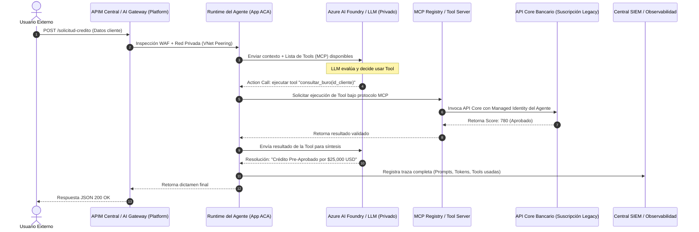
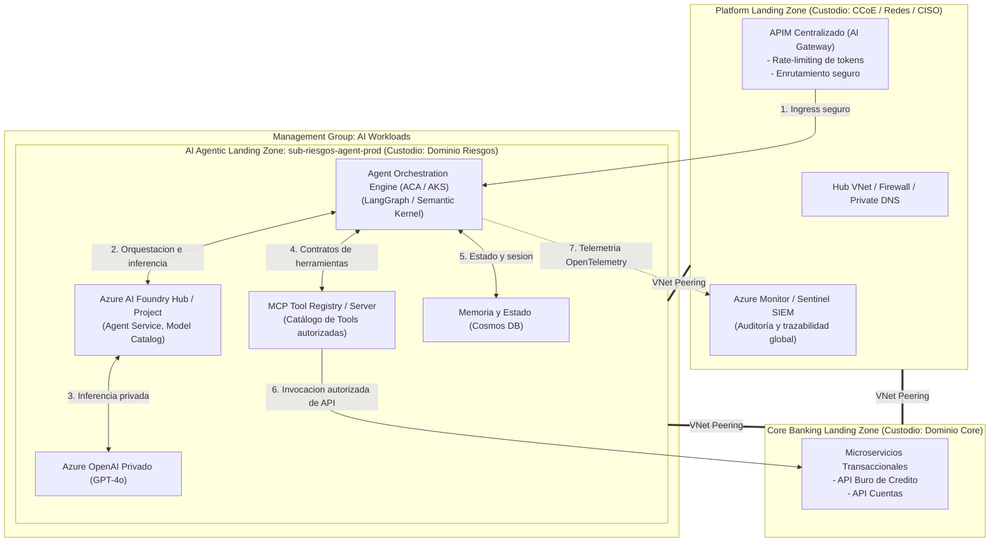
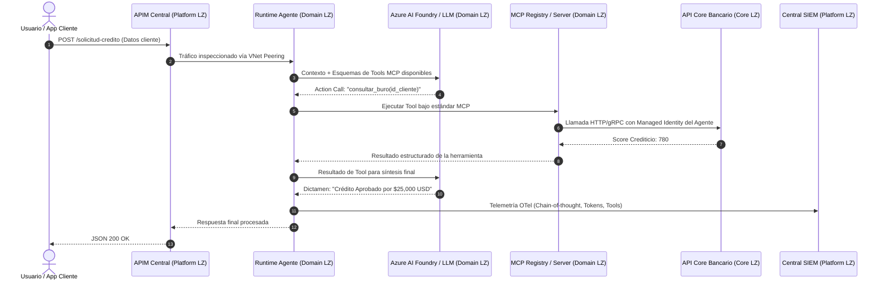

Aquí tienes el desglose **end-to-end** de un sistema agéntico empresarial conforme a los estándares de la industria (**Azure Landing Zones CAF**, **Azure AI Foundry / OpenAI Assistants**, el protocolo **MCP - Model Context Protocol** de Anthropic/Linux Foundation, y lineamientos de seguridad **OWASP Top 10 for LLMs & AI Agents**).

---

### Caso Práctico Empresarial: "Agente Autónomo de Suscripción de Riesgos y Emisión de Pólizas"

* **El Reto:** Un sistema donde un **Agente Coordinador** recibe solicitudes complejas, consulta modelos fundacionales (LLMs), delega tareas mediante **MCP (Model Context Protocol)** a microservicios existentes (Buró de Crédito, Core Bancario, Valuador de Activos) y emite resoluciones de crédito/póliza de forma autónoma.
* **Los 6 Roles Clave:**
  1. **Negocio / Product Owner (PO):** Define reglas de suscripción de riesgo, límites monetarios de autonomía del agente y presupuesto.
  2. **Arquitecto de Soluciones / Software (Tu rol):** Diseña el grafo agéntico, orquestación, contratos MCP/OpenAPI y patrones de resiliencia.
  3. **Equipo de Plataforma / Cloud Ops (CCoE):** Custodio de la Landing Zone Global, conectividad, AI Gateway e IAM central.
  4. **CISO / Ciberseguridad & Gobernanza de IA:** Custodio de guardrails (filtros de contenido, control de alucinaciones, detección de *prompt injection*, RBAC/Managed Identities).
  5. **Equipo Core / Microservicios Legados:** Dueños de las APIs transaccionales que actuarán como "Tools/Herramientas" del agente.
  6. **Equipo Dev / MLOps del Dominio Agéntico:** Desarrolla el runtime agéntico, registra herramientas en el catálogo y mantiene los pipelines.

---

### 1. Mapa de Custodia y Ubicación de Activos (Plataforma vs. Dominio Agéntico)

```mermaid
flowchart TB
    subgraph PLATFORM_LZ ["1. Platform Landing Zone (Custodio: CCoE / Redes / CISO)"]
        direction TB
        HubNet["Hub VNet / Azure Firewall / Private DNS"]
        APIM["APIM Centralizado\n(GenAI Gateway: Token Rate-Limit, WAF, Semantic Caching)"]
        CentralMon["Azure Monitor / Sentinel SIEM Central\n(Auditoría inmutable de decisiones agénticas)"]
        CentralRegistry["Container Registry Corporativo (ACR)\n(Imágenes doradas de runtime y MCP Servers)"]
    end

    subgraph MG_AI ["Management Group: AI Workloads (Políticas Globales)"]
        direction TB
        subgraph DOMAIN_LZ ["2. AI Agentic Application Landing Zone: Suscripción 'sub-riesgos-agent-prod'\n(Custodio: Dominio de Riesgos / Seguros)"]
            direction TB
            subgraph RG_AGENT ["Resource Group: rg-agent-core-prod"]
                AIFoundry["Azure AI Foundry Hub / Project\n(Agent Service, Model Catalog, Prompt Flow)"]
                LLM["Azure OpenAI / Foundry Endpoints\n(GPT-4o / Fine-Tuned con Private Endpoints)"]
                AgentRuntime["Agent Orchestration Engine\n(Azure Container Apps / AKS)\nFramework: LangGraph / Semantic Kernel"]
                AgentRegistry["Agent & Tool Registry (MCP Server Catalog)\n(Metadatos de Tools autorizadas para el agente)"]
                CosmosDB["State Store & Memory (Azure Cosmos DB)\n(Historial de sesiones y memoria episódica)"]
            end
        end
    end

    subgraph CORE_LZ ["3. Core Banking Application Landing Zone (Custodio: Dominio Core)"]
        CoreAPI["Microservicios Transaccionales:\n- API Buro de Credito\n- API Core Bancario / Cuentas"]
    end

    PLATFORM_LZ ===|Peering Troncal| DOMAIN_LZ
    PLATFORM_LZ ===|Peering Troncal| CORE_LZ
    DOMAIN_LZ ===|VNet Peering Privado (Tráfico Tool Execution)| CORE_LZ

    APIM ==>|1. Prompt Seguro / Ingress| AgentRuntime
    AgentRuntime <-->|2. Identidad Foundry / Orchestration| AIFoundry
    AIFoundry <-->|3. Inferencia Privada| LLM
    AgentRuntime <-->|4. Consulta Tools vía MCP| AgentRegistry
    AgentRuntime ==>|5. Invoca Tools autorizadas| CoreAPI
    AgentRuntime -.->|6. Telemetría de Agente (OpenTelemetry)| CentralMon

    classDef platform fill:#0d233a,stroke:#1e4976,stroke-width:2px,color:#fff;
    classDef agentic fill:#0a3522,stroke:#1f8552,stroke-width:2px,color:#fff;
    classDef core fill:#362208,stroke:#8a5716,stroke-width:2px,color:#fff;
    classDef mg fill:#1e1e24,stroke:#444,stroke-width:1px,color:#ddd;

    class PLATFORM_LZ platform;
    class MG_AI mg;
    class DOMAIN_LZ,RG_AGENT agentic;
    class CORE_LZ core;
```

---

### 2. Ciclo de Vida End-to-End: Paso a Paso

#### Fase 1: Negocio y Definición Arquitectónica
* **Negocio / PO:** 
  * *"El agente puede autorizar pólizas/créditos de hasta $50,000 USD de forma autónoma. Por encima de eso, debe requerir aprobación humana (*Human-in-the-loop*)."*
  * Aprueba el presupuesto de consumo de tokens y el centro de costos `CC-RIESGOS-AI`.
* **Arquitecto de Soluciones (Tú):**
  * Modela el patrón agéntico: Un orquestador central (basado en **Semantic Kernel** o **LangGraph**) desplegado sobre **Azure Container Apps** en red privada.
  * Define el protocolo de herramientas: La integración con microservicios legacy no se hará acoplando código, sino a través del estándar **MCP (Model Context Protocol)**, exponiendo servidores MCP que traducen llamadas del LLM a contratos REST/gRPC.
  * Define la gestión del ciclo de vida del agente utilizando **Azure AI Foundry** (para evaluación continua, gestión de versiones del agente y métricas de alucinación).

---

#### Fase 2: Plataforma y Vending de la AI Agentic Landing Zone
* **Equipo de Plataforma (Cloud Ops):**
  * Ejecuta el pipeline automatizado (*Subscription Vending Machine* con arquetipo de IA).
  * Aprovisiona la suscripción `sub-riesgos-agent-prod` bajo el Management Group de `AI-Workloads`.
  * **Lo que la Landing Zone entrega automáticamente:**
    * VNet conectada por Peering privado al Hub corporativo.
    * Enlace a las zonas privadas de DNS (`privatelink.openai.azure.com`, `privatelink.cognitiveservices.azure.com`).
    * Instancia preconfigurada de **Azure AI Foundry Hub** vinculada a un Azure OpenAI privado y a un Key Vault sin llaves de acceso local (puramente Entra ID RBAC).
* **CISO / Ciberseguridad:**
  * Las **Azure Policies** asociadas a la Landing Zone verifican en tiempo real:
    * El Content Safety de Azure AI Foundry debe estar configurado en modo estricto (bloqueo de jailbreaks, odio y auto-lesiones).
    * Ningún recurso puede tener IP pública.
    * Activación obligatoria de **Diagnostic Settings** hacia el SIEM (Sentinel) corporativo.

---

#### Fase 3: Identidad Foundry, Seguridad Agéntica y MCP Tools Registry
* **Arquitecto de Soluciones + CISO (Identidad Agéntica):**
  * **El Agente no es un usuario humano, pero tampoco usa una API Key.**
  * Se crea una **Identidad Administrada Asignada por el Usuario (User-Assigned Managed Identity)** llamada `id-agente-riesgos-prod`.
  * Esta identidad se vincula en **Azure AI Foundry**:
    * Rol `Cognitive Services OpenAI User` sobre el endpoint del LLM.
    * Rol `Storage Blob Data Reader` sobre las bases de conocimiento internas.
    * Permisos específicos en el APIM para invocar únicamente los microservicios que corresponden a sus *Tools* autorizadas.
* **Equipo de Desarrollo del Dominio (Creación del Registry de MCP):**
  * Despliegan un **MCP Tool Registry** (un catálogo privado donde se exponen las interfaces de herramientas que el agente puede usar: `consultar_buro_credito`, `verificar_saldo_cuenta`, `calcular_score_riesgo`).
  * Cada herramienta valida el esquema JSON de entrada antes de tocar cualquier microservicio legado, protegiendo al backend de ejecuciones defectuosas del agente.

---

#### Fase 4: Integración con el APIM Central (AI Gateway Pattern)
* **Equipo Dev del Dominio + Equipo de Plataforma:**
  * El agente necesita consumir APIs existentes que viven en otras suscripciones (ej. la suscripción del Core Bancario).
  * Se publican estas APIs en el **APIM Centralizado**, pero se aplican políticas especializadas de **AI Gateway**:
    1. **Validación de Token Entra ID:** Solo la Managed Identity `id-agente-riesgos-prod` tiene permiso para invocar el endpoint de consulta de buró crediticio en el APIM.
    2. **Token Rate Limiting (TPM/RPM):** El APIM evita que el bucle autónomo del agente entre en un ciclo infinito de consultas y consuma el presupuesto de la empresa.
    3. **Semantic Caching:** Si el agente realiza dos consultas semánticamente equivalentes a la base de conocimiento o al LLM, el APIM devuelve la respuesta cacheada sin incurrir en costos de inferencia.

---

#### Fase 5: Observabilidad, Evaluación y Monitoreo del Agente
* **Arquitecto de Soluciones y MLOps:**
  * El código del agente implementa trazabilidad estándar con **OpenTelemetry** compatible con **Azure AI Foundry Tracing** y **Application Insights**.
  * Cada decisión del agente genera un rastro auditable estructurado:
    $$\text{Trace ID} \longrightarrow \text{Pensamiento (Chain-of-Thought)} \longrightarrow \text{Tool MCP Elegida} \longrightarrow \text{Respuesta de la Tool} \longrightarrow \text{Acción Final}$$
* **Equipo de Plataforma y CISO:**
  * La Landing Zone ya tenía configurado el envío automático de telemetría a **Log Analytics / Sentinel**.
  * Si el agente intenta invocar una herramienta no autorizada o recibe una inyección de prompt por parte de un usuario, el evento se clasifica como incidente de seguridad de severidad alta en el SOC (Security Operations Center) corporativo.

---

### 3. Secuencia de Ejecución en Tiempo de Ejecución (Runtime)



---

### 4. Matriz de Custodia Definitiva (¿Quién es dueño de qué?)

| Componente | Capa de la Arquitectura | Custodio Primario | Responsabilidad |
| :--- | :--- | :--- | :--- |
| **AI Gateway Policies & WAF** | Platform

Disculpa el corte en la respuesta anterior y el error en el diagrama. Aquí tienes la finalización limpia y corregida de toda la sección, con los diagramas Mermaid debidamente estructurados y la **matriz completa de custodia**.

---

### 1. Diagrama de Arquitectura Corregido



---

### 2. Flujo de Ejecución en Tiempo Real (Secuencia de Interacción)



---

### 3. Matriz de Custodia Definitiva (RACI por Componente)

Para cerrar la duda sobre **quién responde por qué elemento** en este modelo:

| Componente | Capa Arquitectónica | Custodio Primario | Responsabilidad Clave |
| :--- | :--- | :--- | :--- |
| **Zonas DNS Privadas y Red Troncal** | Platform Landing Zone | **Equipo de Redes / Plataforma** | Asegurar resolución interna privada sin exposición a internet pública. |
| **AI Gateway & APIM Central** | Platform Landing Zone | **Equipo de Plataforma / CCoE** | Gestionar cuotas globales de tokens (TPM/RPM), WAF perimetral y cache semántico. |
| **Repositorio SIEM / Log Analytics** | Platform Landing Zone | **CISO / SOC Corporativo** | Retención inmutable de logs, alertas de seguridad ante intentos de *jailbreak* o *prompt injection*. |
| **Guardrails & Políticas de IA** | Management Group (`AI-Workloads`) | **CISO / Gobierno de Datos** | Forzar políticas duras: prohibir autenticación por API Keys, bloquear IPs públicas y exigir TLS 1.3. |
| **Azure AI Foundry (Hub / Project)** | AI Application Landing Zone | **Arquitecto de Solución / Tech Lead del Dominio** | Configurar el catálogo de modelos aprobados, filtros de contenido (*Content Safety*) y evaluación continua de alucinación. |
| **Managed Identity del Agente** | AI Application Landing Zone | **Arquitecto de Solución + IAM** | Identidad sin contraseñas asignada al agente; define qué tools y qué microservicios específicos tiene permiso de invocar. |
| **Runtime del Agente (ACA / AKS)** | AI Application Landing Zone | **Equipo Dev / MLOps del Dominio** | Mantenimiento del ciclo agéntico (LangGraph/Semantic Kernel), gestión de memoria en Cosmos DB y manejo de errores. |
| **MCP Tool Registry / Server** | AI Application Landing Zone | **Equipo Dev del Dominio Agéntico** | Validar que los esquemas JSON de las Tools cumplan el protocolo MCP antes de invocar los backends. |
| **Microservicios Core (Backend Tools)** | Suscripciones de Otros Dominios (ej. Core Bancario) | **Equipo de Desarrollo del Core** | Exponer endpoints transaccionales internos y validar que las llamadas contengan el token de la Managed Identity autorizada. |
| **Reglas de Negocio y Límites del Agente** | Nivel Solución / Producto | **Product Owner (PO) / Negocio** | Definir montos máximos de autonomía del agente y cuándo activar el desvío a un humano (*Human-in-the-loop*). |

---

### Síntesis para el Arquitecto de Software
1. **La Platform Landing Zone** te da la autopista segura (redes privadas, inspección de seguridad perimetral, Gateway para control de consumo de tokens y observabilidad unificada).
2. **La AI Application Landing Zone** te da la suscripción aislada con Azure AI Foundry, endpoints privados de LLM y cuotas de cómputo dedicadas a tu caso de uso.
3. **Tú como Arquitecto de Soluciones:** Eres el dueño del comportamiento agéntico. Diseñas cómo el runtime orquesta la llamada al LLM, la integración desacoplada vía **MCP** hacia las herramientas externas, la identidad que representa al agente y las políticas de mitigación ante alucinaciones.