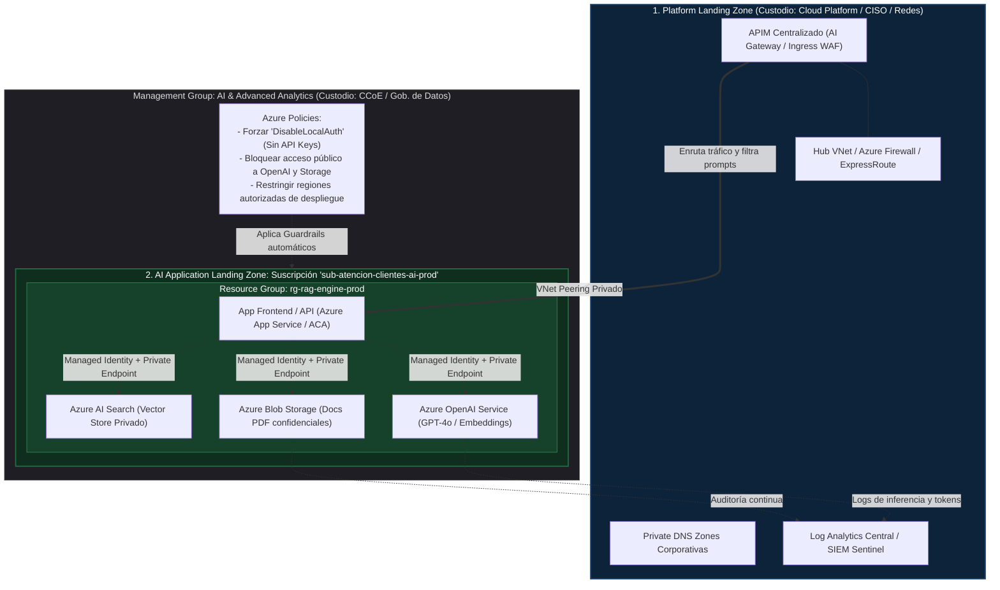
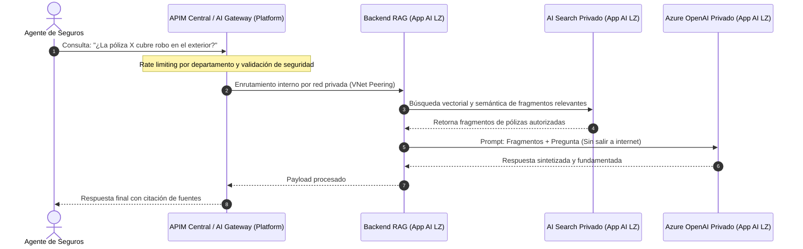

El concepto de **Azure AI Landing Zone** (o en términos agnósticos de la industria, una *Workload-specific Landing Zone / AI Pattern Blueprint*) responde a una realidad crítica: las aplicaciones de IA Generativa y analítica avanzada tienen **vectores de riesgo y dependencias de infraestructura radicalmente distintas** a una API web tradicional.

Si una API común expone puertos HTTP y bases de datos relacionales, una solución de IA manipula:
* LLMs y modelos fundacionales (ej. Azure OpenAI, AWS Bedrock).
* Bases de datos vectoriales e índices de búsqueda (Azure AI Search, OpenSearch, Pinecone).
* Datos no estructurados sensibles (repositorios de documentos para arquitecturas **RAG** - *Retrieval-Augmented Generation*).
* Endpoints privados para evitar que el tráfico o los prompts viajen por internet pública.

A continuación, se detalla la integración de estos conceptos con un **ejemplo end-to-end de una solución real**, delimitando la frontera entre la **Platform Landing Zone** y la **AI Application Landing Zone**.

---

### 1. El Problema que Resuelve la AI Landing Zone

Cuando un equipo de desarrollo intenta desplegar IA sin una AI Landing Zone:
1. **Riesgo de fuga de datos (Data Leakage):** Crean instancias de Azure OpenAI con IPs públicas y claves API compartidas en archivos `.env`.
2. **Inconsistencia de Arquitectura:** Un equipo usa LangChain sobre una VM no auditada, otro usa servicios PaaS sin endpoints privados.
3. **Lentitud en producción:** Pasar de una Prueba de Concepto (PoC) en un Jupyter Notebook a un entorno con cumplimiento corporativo toma meses.

Como destaca el video del Azure CAF, la **AI Landing Zone** es un **acelerador de arquitectura como código (IaC)** que reduce los ciclos en un 60%: entrega una suscripción de carga de trabajo ya preconfigurada con *Private Endpoints*, zonas DNS privadas, autenticación sin claves (*Managed Identities*), y control de cuotas/TPM (*Tokens Per Minute*) hacia los modelos fundacionales.

---

### 2. Arquitectura Global: Platform Landing Zone vs. AI Application Landing Zone

---

### 3. Ejemplo End-to-End: "Copilot Corporativo de Políticas Internas y Pólizas"

* **Dominio de Negocio:** Operaciones y Seguros.
* **Solución de Software:** Aplicación RAG (Retrieval-Augmented Generation) para que los agentes resuelvan dudas complejas consultando 50.000 pólizas en formato PDF sin enviar datos sensibles a internet abierta.

Veamos la interacción paso a paso, qué recurso se despliega y quién es el custodio legal y técnico.

---

### 4. Matriz de Custodia y Responsabilidad (RACI de la Solución)

Para entender cómo se divide el gobierno entre la plataforma central y el equipo del dominio:

| Componente / Activo | Ubicación en la Nube | Custodio Principal | Rol del Custodio |
| :--- | :--- | :--- | :--- |
| **Zonas DNS Privadas y Red Troncal** | Suscripción de Conectividad (Platform Landing Zone) | **Equipo de Redes / Plataforma** | Garantiza que `privatelink.openai.azure.com` resuelva internamente sin salir a internet. |
| **AI Gateway / APIM Central** | Suscripción Shared Services (Platform Landing Zone) | **Equipo de Plataforma / CCoE** | Gestiona el WAF perimetral, la cuota global de tokens y las métricas de latencia de red. |
| **Azure Policies para IA** | Management Group `AI-Workloads` | **CISO / Oficial de Cumplimiento** | Garantiza que nadie pueda crear un modelo de IA con IP pública ni autenticación por API Key simple. |
| **Suscripción `sub-atencion-clientes-ai-prod`** | Nivel Suscripción (Application Landing Zone) | **Líder Técnico del Dominio (Tech Lead)** | Administra el presupuesto específico, las cuotas de inferencia asignadas y los accesos de su equipo. |
| **Modelos Desplegados (GPT-4o, Text-Embedding)** | Grupo de Recursos dentro de la suscripción de AI | **Arquitecto de Solución de IA / MLOps** | Elige las versiones de los modelos, ajusta los TPM (Tokens por minuto) y configura el escalado. |
| **Base Vectorial (Azure AI Search)** | Grupo de Recursos dentro de la suscripción de AI | **Data Engineer / Devs del Dominio** | Define esquemas de indexación, campos semánticos y estrategias de chunking de documentos. |
| **Documentos y PDFs de Negocio (Blob Storage)** | Grupo de Recursos dentro de la suscripción de AI | **Data Owner (Negocio / Seguros)** | Clasifica la información (Confidencial/Restringida) y define retenciones legales de datos. |

---

### 5. ¿Qué entrega la "AI Landing Zone" al equipo de desarrollo lista para usar?

Cuando el equipo de Plataforma ejecuta la plantilla de **AI Landing Zone** (vía Terraform o Bicep, basada en los repositorios de Microsoft CAF / AWS Well-Architected for Generative AI), el equipo del dominio recibe en minutos:

1. **Una suscripción aislada:** Con cuotas asignadas para cómputo de GPU/OpenAI.
2. **Topología de red cerrada:** Una subred propia conectada a la VNet Hub mediante *VNet Peering*, sin IP pública (Zero Public IP posture).
3. **PaaS con Private Endpoints ya creados:**
   * La instancia de **Azure OpenAI** solo escucha conexiones dentro de la red privada corporativa.
   * El servicio de **Azure AI Search** no expone su endpoint en internet.
   * El **Azure Blob Storage** tiene habilitado cifrado con claves administradas y autenticación exclusiva por Entra ID (RBAC).
4. **Guardrails activos:** Si un desarrollador intenta cambiar la configuración de red de OpenAI a "All Networks: Enabled", Azure Policy bloquea la acción inmediatamente y emite una alerta al SIEM central.

### Conclusión para el Arquitecto de Software
La **AI Landing Zone** no le dice a tu equipo cómo programar su aplicación RAG o qué librería de agentes utilizar (Semantic Kernel, LangChain, LlamaIndex). 

Lo que hace es **eliminar meses de fricción burocrática y de seguridad**: te provee de forma instantánea una infraestructura de IA con cumplimiento regulatorio, conectividad privada y autenticación robusta, permitiendo que el equipo de desarrollo se enfoque exclusivamente en los datos, los prompts y la lógica de negocio.