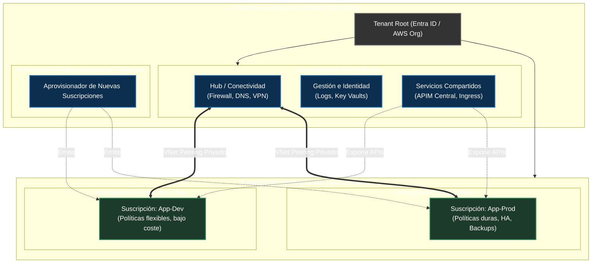
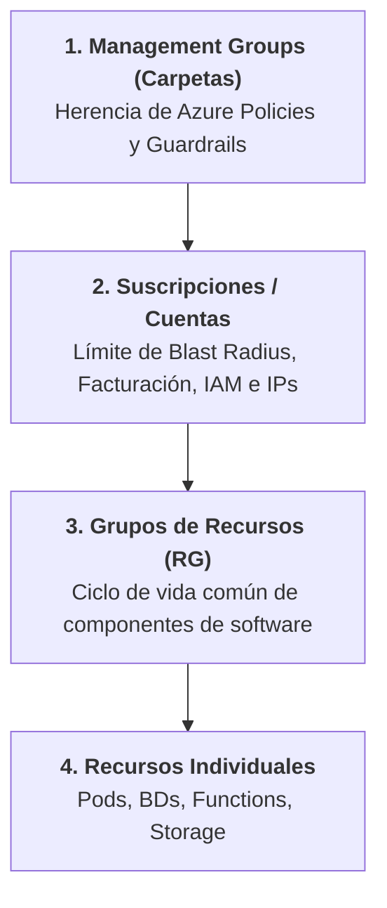
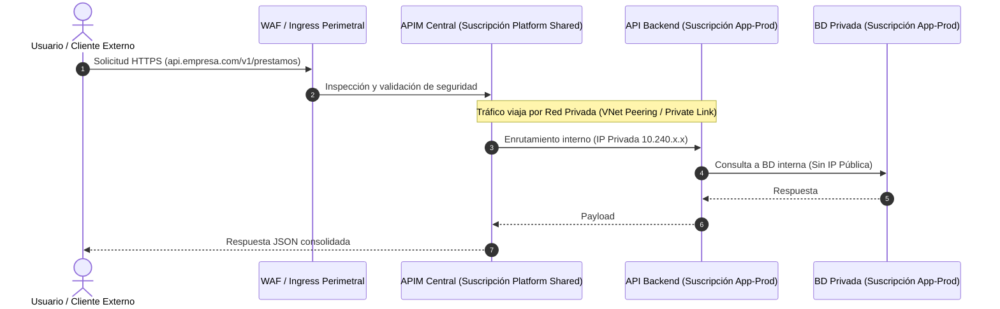

# Guía de Arquitectura Cloud: Fundamentos de Landing Zones y Gobernanza Empresarial

Esta síntesis compila los conceptos, modelos operativos y patrones arquitectónicos clave analizados, diseñados para cerrar la brecha conceptual entre la **Arquitectura de Software/Soluciones** y la **Arquitectura de Plataforma Cloud**.

---

## 1. Definición Agnóstica y Propósito Esencial

Una **Landing Zone** no es una aplicación de software, un arquetipo de código ni un empaquetado de microservicios.

> **Definición Agnóstica:**  
> Es un entorno multi-cuenta/multi-suscripción aprovisionado mediante Infraestructura como Código (IaC), que establece la **identidad, conectividad de red, seguridad (guardrails), observabilidad y jerarquía organizativa** antes de que se despliegue cualquier carga de trabajo.

### La frontera de responsabilidades
* **Landing Zone (Cloud Platform / CCoE):** Provee el "terreno urbanizado" (red privada conectada, firewall perimetral, políticas de seguridad duras, centro de costos asignado).
* **Solución de Software (Arquitecto de Software):** Construye la "casa" dentro de ese terreno (microservicios en Kubernetes, bases de datos, colas de mensajería, lógica de negocio).

---

## 2. Los Dos Significados de "Landing Zone" (El Origen de la Confusión)

La industria (Azure CAF, AWS Prescriptive Guidance) usa el mismo término para dos alcances diferentes:

1. **Platform Landing Zone (Global):** Es única para toda la empresa. Contiene la infraestructura central compartida (red troncal, firewalls corporativos, APIM compartido y observabilidad central).
2. **Application Landing Zone (Workload):** Es la suscripción/cuenta individual que se le otorga a un equipo de desarrollo específico. Se genera mediante un pipeline automatizado (**Subscription Vending Machine**), integrándose a la red y a la gobernanza global sin recrear la infraestructura central.

---

## 3. Jerarquía y Mecanismos de Aislamiento

Para garantizar que un incidente en desarrollo o en un dominio de negocio no comprometa a toda la organización, los recursos se ordenan en cuatro niveles de contención:

| Nivel | Rol / Concepto | Función Arquitectónica |
| :--- | :--- | :--- |
| **Management Group** | Gobernanza jerárquica | Se definen políticas que aplican por herencia hacia abajo (ej. *“En Non-Prod se permiten VMs económicas; en Prod se exigen zonas de disponibilidad”*). |
| **Suscripción (o AWS Account)** | Frontera de aislamiento (*Blast Radius*) | Separa entornos (**Dev vs. Prod**) y dominios (**Pagos vs. Inventario**). Evita colisión de cuotas de cómputo y separa centros de costos. |
| **Grupo de Recursos (RG)** | Ciclo de vida de la aplicación | Agrupa recursos de una misma solución que nacen y mueren juntos (ej. `rg-pagos-backend-prod`). Borrar el RG no destruye la red ni la suscripción. |
| **Recurso** | Componente de cómputo/datos | El servicio individual desplegado (PostgreSQL, AKS, Azure Functions). |

---

## 4. Patrón de Integración en Malla: APIM Centralizado (Hub & Spoke)

Cuando la organización exige que todos los servicios pasen por un API Management centralizado:

* **Suscripción de Plataforma:** El equipo de redes/plataforma mantiene la instancia de APIM y el WAF.
* **Suscripción del Dominio:** El equipo de software despliega sus APIs con **IPs privadas** en subredes aisladas.
* **Integración:** El equipo de software no administra el APIM; registra sus especificaciones (OpenAPI / Swagger) mediante Pull Requests a un pipeline federado de integración continua.

---

## 5. Greenfield vs. Brownfield: ¿Se puede implementar tarde?

* **Greenfield (Ideal / Deber Ser):** Se despliega la Landing Zone antes de que exista la primera aplicación en la nube. Ahorra refactorizaciones y colisiones de red posteriores.
* **Brownfield (Realidad de la Industria):** Se aplica sobre una nube que ya tiene aplicaciones en producción sin arquitectura formal:
1. Se construye la Landing Zone global en paralelo.
2. Se colocan las suscripciones existentes bajo un grupo transitorio (`Legacy` o `Migration`).
3. Se aplican políticas en modo **Auditoría (Audit-Only)** para detectar brechas sin romper producción.
4. Se corrigen las redes y se mueven las suscripciones al grupo definitivo (`Prod` o `Non-Prod`).

---

## 6. Equivalencias entre Proveedores Cloud

| Dimensión | Azure | AWS | Google Cloud (GCP) |
| :--- | :--- | :--- | :--- |
| **Framework Base** | Azure Landing Zones (CAF) | AWS Landing Zone / Well-Architected | Cloud Foundation Fabric |
| **Herramienta Orquestadora** | ALZ Terraform Module / Bicep | AWS Control Tower | Foundation Toolkit / Terraform |
| **Jerarquía de Políticas** | Management Groups + Azure Policy | AWS Organizations + SCPs | Organization Policies + Folders |
| **Límite de Aislamiento** | Subscription | AWS Account | GCP Project |
| **Dispensador de Entornos** | Subscription Vending Machine | Account Factory (AFT) | Project Factory Module |